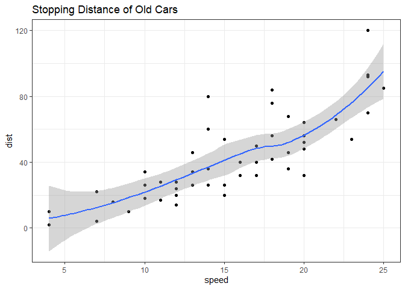
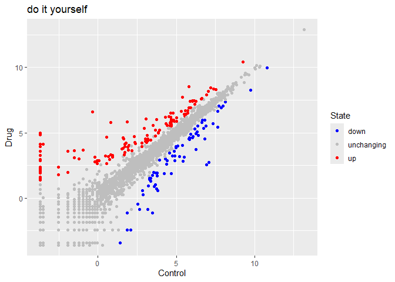

# class05: Data viz with ggplot
Angie (PID: A69028746)
2024-01-24

## Graphics systems in R

There are many graphics systems for R. These include so-called *“Base
R”* and those in add-on packaegs like `ggplot2`.

``` r
plot(cars)
```


How can we make this with `ggplot2`

This is an add-on package and I first need to install it on my computer.
This install is a one time only deal.

To install any package I use the `install. packages()` function.

To use it we need to load up the package from our library of install
packages. For this I use ’library(ggplot2)

``` r
library(ggplot2)
ggplot(cars)
```


Using ggplot is not as straight forward as base R plot for basic plots.
I have some more typing to do.

Every ggplot has at least 3 things (layers):

- **data** (data.frame)
- **aes** (how the data map to the plot)
- **geoms** (think of this as the type of plot, e.g. point, lines, etc.)

``` r
ggplot(cars) + aes(x=speed, y=dist) + geom_point()
```


Here ggplot was more verbose - i.e. I had more typing to do - than base
R. However, I can

``` r
ggplot(cars) + aes(speed, dist) + geom_point() + geom_smooth() + labs(title = "Stopping Distance of Old Cars") + theme_bw()
```

    `geom_smooth()` using method = 'loess' and formula = 'y ~ x'



``` r
p <- ggplot(cars) + aes(x=speed, y=dist) + geom_point()
```

``` r
library(patchwork)
```

``` r
url <- "https://bioboot.github.io/bimm143_S20/class-material/up_down_expression.txt"
genes <- read.delim(url)
head(genes)
```

            Gene Condition1 Condition2      State
    1      A4GNT -3.6808610 -3.4401355 unchanging
    2       AAAS  4.5479580  4.3864126 unchanging
    3      AASDH  3.7190695  3.4787276 unchanging
    4       AATF  5.0784720  5.0151916 unchanging
    5       AATK  0.4711421  0.5598642 unchanging
    6 AB015752.4 -3.6808610 -3.5921390 unchanging

Q. Use the nrow() function to find out how many genes are in this
dataset. What is your answer?

``` r
nrow(genes)
```

    [1] 5196

Q. Use the colnames() function and the ncol() function on the genes data
frame to find out what the column names are (we will need these later)
and how many columns there are. How many columns did you find?

``` r
ncol(genes)
```

    [1] 4

``` r
colnames(genes)
```

    [1] "Gene"       "Condition1" "Condition2" "State"     

Q. Use the table() function on the State column of this data.frame to
find out how many ‘up’ regulated genes there are. What is your answer?

``` r
table(genes$State)
```


          down unchanging         up 
            72       4997        127 

Q. Using your values above and 2 significant figures. What fraction of
total genes is up-regulated in this dataset?

``` r
table(genes$State)/nrow(genes) * 100
```


          down unchanging         up 
      1.385681  96.170131   2.444188 

``` r
round( table(genes$State)/nrow(genes) * 100, 2 )
```


          down unchanging         up 
          1.39      96.17       2.44 

``` r
p <- ggplot(genes) + 
    aes(x=Condition1, y=Condition2, col=State) +
    geom_point()
p
```


``` r
p <- ggplot(genes) + 
    aes(x=Condition1, y=Condition2, col=State) +
    geom_point()
p + scale_colour_manual( values=c("blue","gray","red") ) + labs(title="do it yourself", x="Control", y="Drug")
```



``` r
p2 <- ggplot(genes) + 
    aes(x=Condition1, y=Condition2, col=State, name=Gene) +
    geom_point()
p2 + scale_colour_manual( values=c("blue","gray","red") ) + labs(title="do it yourself", x="Control", y="Drug")
```


\#this is an interactive file

``` r
library(plotly)

#ggplotly(p2)
```

``` r
#ggplotly(p2)
```

## Quarto

Quarto enables you to weave together content and executable code into a
finished document. To learn more about Quarto see <https://quarto.org>.

## Running Code

This is just text.

- a **list**
- *of some*
- things

``` r
sqrt(10)
```

    [1] 3.162278

When you click the **Render** button a document will be generated that
includes both content and the output of embedded code. You can embed
code like this:

``` r
# This is code chunk
5+10
```

    [1] 15

``` r
plot(1:10)
```


You can add options to executable code like this

    [1] 4

The `echo: false` option disables the printing of code (only output is
displayed).
