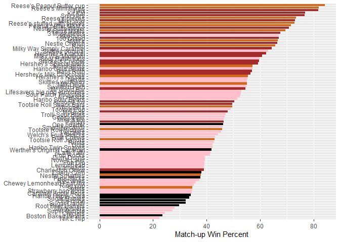
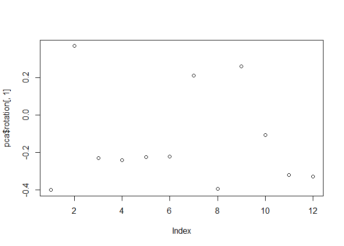
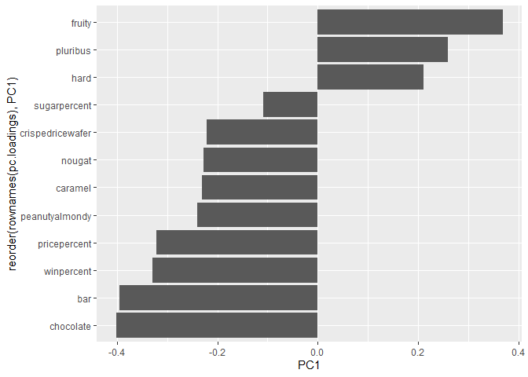
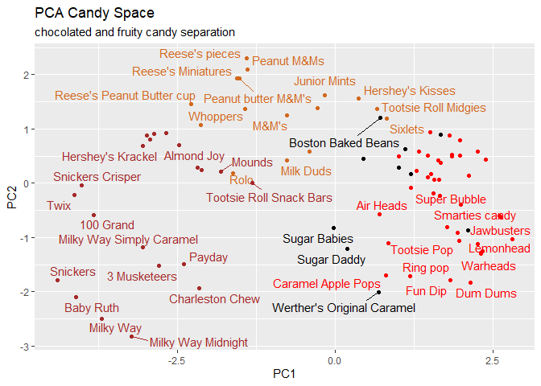

# Halloween_mini_project
Angie Zhou(PID:69028746)
2024-02-07

# 1. Importing candy data

``` r
candy_file <- "candy-data.csv"
candy = read.csv(candy_file, row.names=1)
head(candy)
```

                 chocolate fruity caramel peanutyalmondy nougat crispedricewafer
    100 Grand            1      0       1              0      0                1
    3 Musketeers         1      0       0              0      1                0
    One dime             0      0       0              0      0                0
    One quarter          0      0       0              0      0                0
    Air Heads            0      1       0              0      0                0
    Almond Joy           1      0       0              1      0                0
                 hard bar pluribus sugarpercent pricepercent winpercent
    100 Grand       0   1        0        0.732        0.860   66.97173
    3 Musketeers    0   1        0        0.604        0.511   67.60294
    One dime        0   0        0        0.011        0.116   32.26109
    One quarter     0   0        0        0.011        0.511   46.11650
    Air Heads       0   0        0        0.906        0.511   52.34146
    Almond Joy      0   1        0        0.465        0.767   50.34755

> **Q1.** How many different candy types are in this dataset?

> **A1.** There are 85 different candy types are in this dataset

``` r
dim(candy)
```

    [1] 85 12

``` r
nrow(candy)
```

    [1] 85

``` r
# How many variables/dimensions are there?
ncol(candy)
```

    [1] 12

> **Q2.** How many fruity candy types are in the dataset?

> **A2.** There are 38 fruity candy types

``` r
sum(candy$fruity)
```

    [1] 38

# 2. What is your favorate candy?

## data exploration

> **Q3.** What is your favorite candy in the dataset and what is it’s
> winpercent value?

> **A3.** My favorite candy is Snickers, its winpercent value is
> 76.67378.

``` r
candy["Snickers", ]$winpercent
```

    [1] 76.67378

> **Q4.** What is the winpercent value for “Kit Kat”?

``` r
candy["Kit Kat", ]$winpercent
```

    [1] 76.7686

> **Q5.** What is the winpercent value for “Tootsie Roll Snack Bars”?

``` r
candy["Tootsie Roll Snack Bars", ]$winpercent
```

    [1] 49.6535

``` r
library("skimr")
skimr::skim(candy)
```

|                                                  |       |
|:-------------------------------------------------|:------|
| Name                                             | candy |
| Number of rows                                   | 85    |
| Number of columns                                | 12    |
| \_\_\_\_\_\_\_\_\_\_\_\_\_\_\_\_\_\_\_\_\_\_\_   |       |
| Column type frequency:                           |       |
| numeric                                          | 12    |
| \_\_\_\_\_\_\_\_\_\_\_\_\_\_\_\_\_\_\_\_\_\_\_\_ |       |
| Group variables                                  | None  |

Data summary

**Variable type: numeric**

| skim_variable    | n_missing | complete_rate |  mean |    sd |    p0 |   p25 |   p50 |   p75 |  p100 | hist  |
|:-----------------|----------:|--------------:|------:|------:|------:|------:|------:|------:|------:|:------|
| chocolate        |         0 |             1 |  0.44 |  0.50 |  0.00 |  0.00 |  0.00 |  1.00 |  1.00 | ▇▁▁▁▆ |
| fruity           |         0 |             1 |  0.45 |  0.50 |  0.00 |  0.00 |  0.00 |  1.00 |  1.00 | ▇▁▁▁▆ |
| caramel          |         0 |             1 |  0.16 |  0.37 |  0.00 |  0.00 |  0.00 |  0.00 |  1.00 | ▇▁▁▁▂ |
| peanutyalmondy   |         0 |             1 |  0.16 |  0.37 |  0.00 |  0.00 |  0.00 |  0.00 |  1.00 | ▇▁▁▁▂ |
| nougat           |         0 |             1 |  0.08 |  0.28 |  0.00 |  0.00 |  0.00 |  0.00 |  1.00 | ▇▁▁▁▁ |
| crispedricewafer |         0 |             1 |  0.08 |  0.28 |  0.00 |  0.00 |  0.00 |  0.00 |  1.00 | ▇▁▁▁▁ |
| hard             |         0 |             1 |  0.18 |  0.38 |  0.00 |  0.00 |  0.00 |  0.00 |  1.00 | ▇▁▁▁▂ |
| bar              |         0 |             1 |  0.25 |  0.43 |  0.00 |  0.00 |  0.00 |  0.00 |  1.00 | ▇▁▁▁▂ |
| pluribus         |         0 |             1 |  0.52 |  0.50 |  0.00 |  0.00 |  1.00 |  1.00 |  1.00 | ▇▁▁▁▇ |
| sugarpercent     |         0 |             1 |  0.48 |  0.28 |  0.01 |  0.22 |  0.47 |  0.73 |  0.99 | ▇▇▇▇▆ |
| pricepercent     |         0 |             1 |  0.47 |  0.29 |  0.01 |  0.26 |  0.47 |  0.65 |  0.98 | ▇▇▇▇▆ |
| winpercent       |         0 |             1 | 50.32 | 14.71 | 22.45 | 39.14 | 47.83 | 59.86 | 84.18 | ▃▇▆▅▂ |

> **Q6.** Is there any variable/column that looks to be on a different
> scale to the majority of the other columns in the dataset?

> **A6.** Yes. The “winpercent” looks to be on a different scale. The
> mean value for “winpercent” is 50.32 with a sd of 14.71, which
> indicates a relatively wide spread of values around the mean.

> **Q7.** What do you think a zero and one represent for the
> candy\$chocolate column?

> **A7.** In the candy\$chocolate column, a zero and one represent
> binary values indicating the presence or absence of chocolate in the
> respective candies. 0: Indicates that the candy does not contain
> chocolate. 1: Indicates that the candy contains chocolate

> **Q8.** Plot a histogram of winpercent values

``` r
library(ggplot2)
ggplot(candy) + 
  aes(winpercent) +
  geom_histogram(binwidth = 8)
```


> **Q9.** Is the distribution of winpercent values symmetrical?

> **A9.** No

> **Q10.** Is the center of the distribution above or below 50%?

> **A10.** Below 50%

``` r
summary(candy$winpercent)
```

       Min. 1st Qu.  Median    Mean 3rd Qu.    Max. 
      22.45   39.14   47.83   50.32   59.86   84.18 

> **Q11.** On average is chocolate candy higher or lower ranked than
> fruity candy?

> **A11.** Chocolate candy(60.92) is higher ranked than fruity
> candy(44.11).

- first find all chocolate candy (subset)
- get their winpercent values
- summarize these values into one metric
- do the same for fruity candy and compare

``` r
choc.inds <- as.logical(candy$chocolate)
choc.win <- candy[choc.inds,]$winpercent
mean(choc.win)
```

    [1] 60.92153

``` r
fruit.inds <- as.logical(candy$fruity)
fruit.win <- candy[fruit.inds,]$winpercent
mean(fruit.win)
```

    [1] 44.11974

> **Q12.** Is this difference statistically significant?

> **A12.** Yes. A very low p-value=2.871e-08 (close to zero) suggests
> that the observed difference is statistically significant.

``` r
t.test(choc.win, fruit.win)
```


        Welch Two Sample t-test

    data:  choc.win and fruit.win
    t = 6.2582, df = 68.882, p-value = 2.871e-08
    alternative hypothesis: true difference in means is not equal to 0
    95 percent confidence interval:
     11.44563 22.15795
    sample estimates:
    mean of x mean of y 
     60.92153  44.11974 

# 3. Overall Candy Rankings

> **Q13.** What are the five least liked candy types in this set?

> **A13.** The five least liked candy types are Nik L Nip, Boston Baked
> Beans, Chiclets, Super Bubble, Jawbusters

``` r
inds <- order(candy$winpercent)
head(candy[inds,], n=5)
```

                       chocolate fruity caramel peanutyalmondy nougat
    Nik L Nip                  0      1       0              0      0
    Boston Baked Beans         0      0       0              1      0
    Chiclets                   0      1       0              0      0
    Super Bubble               0      1       0              0      0
    Jawbusters                 0      1       0              0      0
                       crispedricewafer hard bar pluribus sugarpercent pricepercent
    Nik L Nip                         0    0   0        1        0.197        0.976
    Boston Baked Beans                0    0   0        1        0.313        0.511
    Chiclets                          0    0   0        1        0.046        0.325
    Super Bubble                      0    0   0        0        0.162        0.116
    Jawbusters                        0    1   0        1        0.093        0.511
                       winpercent
    Nik L Nip            22.44534
    Boston Baked Beans   23.41782
    Chiclets             24.52499
    Super Bubble         27.30386
    Jawbusters           28.12744

> **Q14.** What are the top 5 all time favorite candy types out of this
> set?

> **A14.** The top 5 all time favorite candy types are Snickers, Kit
> Kat, Twix, Reese’s Miniatures, Reese’s Peanut Butter cup

``` r
inds <- order(candy$winpercent)
tail(candy[inds,], n=5)
```

                              chocolate fruity caramel peanutyalmondy nougat
    Snickers                          1      0       1              1      1
    Kit Kat                           1      0       0              0      0
    Twix                              1      0       1              0      0
    Reese's Miniatures                1      0       0              1      0
    Reese's Peanut Butter cup         1      0       0              1      0
                              crispedricewafer hard bar pluribus sugarpercent
    Snickers                                 0    0   1        0        0.546
    Kit Kat                                  1    0   1        0        0.313
    Twix                                     1    0   1        0        0.546
    Reese's Miniatures                       0    0   0        0        0.034
    Reese's Peanut Butter cup                0    0   0        0        0.720
                              pricepercent winpercent
    Snickers                         0.651   76.67378
    Kit Kat                          0.511   76.76860
    Twix                             0.906   81.64291
    Reese's Miniatures               0.279   81.86626
    Reese's Peanut Butter cup        0.651   84.18029

> **Q15.** Make a first barplot of candy ranking based on winpercent
> values.

``` r
library(ggplot2)
ggplot(candy) + 
  aes(winpercent, rownames(candy)) +
  geom_col()
```


> **Q16.** This is quite ugly, use the reorder() function to get the
> bars sorted by winpercent?

``` r
library(ggplot2)
ggplot(candy) + 
  aes(winpercent, reorder(rownames(candy),winpercent)) +
  geom_col()+
  labs(x="Match-up Win Percent", y=NULL)
```


``` r
ggsave("barplot1.png", height = 10, width = 7)
```

### we can now insert any image using markdown syntax this is ! followed by \[\] and then ()


> **Q17.** What is the worst ranked chocolate candy?

> **A17.** The worst ranked chocolate candy is Sixlets

``` r
chocolate_candies <- candy[candy$chocolate == 1, ]
worst_ranked_chocolate <- chocolate_candies[which.min(chocolate_candies$winpercent), ]
worst_ranked_chocolate
```

            chocolate fruity caramel peanutyalmondy nougat crispedricewafer hard
    Sixlets         1      0       0              0      0                0    0
            bar pluribus sugarpercent pricepercent winpercent
    Sixlets   0        1         0.22        0.081     34.722

``` r
my_cols <- rep("black", nrow(candy))
my_cols[as.logical(candy$chocolate)] = "chocolate"
my_cols[as.logical(candy$bar)] = "brown"
my_cols[as.logical(candy$fruity)] = "pink"
  ggplot(candy) + 
  aes(winpercent, reorder(rownames(candy),winpercent),)+
    geom_col(fill=my_cols)+
    labs(x="Match-up Win Percent", y=NULL)
```



``` r
ggsave("barplot2.png", height = 10, width = 7)
```


As shown in [Figure 2](#fig-bar) and [Figure 1](#fig-grey), xxxx

> **Q18.** What is the best ranked fruity candy?

> **A18.** The best ranked fruity candy is Starburst.

``` r
fruity_candies <- candy[candy$fruity == 1, ]
best_ranked_fruity <- fruity_candies[which.max(fruity_candies$winpercent), ]
best_ranked_fruity
```

              chocolate fruity caramel peanutyalmondy nougat crispedricewafer hard
    Starburst         0      1       0              0      0                0    0
              bar pluribus sugarpercent pricepercent winpercent
    Starburst   0        1        0.151         0.22   67.03763

# 4. Taking a look at pricepercent

``` r
library(ggrepel)
my_cols[as.logical(candy$fruity)] = "red"

ggplot(candy) +
  aes(winpercent, pricepercent, label=rownames(candy)) +
  geom_point(col=my_cols) + 
  geom_text_repel(col=my_cols, size=3.3, max.overlaps = 5)
```

    Warning: ggrepel: 54 unlabeled data points (too many overlaps). Consider
    increasing max.overlaps


> **Q19.** Which candy type is the highest ranked in terms of winpercent
> for the least money - i.e. offers the most bang for your buck?

> **A19.** Tootsie Roll Midgies is the highest ranked in terms of
> winpercent for the least money

``` r
ord <- order(candy$pricepercent, decreasing = TRUE)
tail(candy[ord,c(11,12)], n=5 )
```

                         pricepercent winpercent
    Strawberry bon bons         0.058   34.57899
    Dum Dums                    0.034   39.46056
    Fruit Chews                 0.034   43.08892
    Pixie Sticks                0.023   37.72234
    Tootsie Roll Midgies        0.011   45.73675

``` r
win_to_price_ratio <- candy$winpercent / candy$pricepercent
best_value_candy <- candy[which.max(win_to_price_ratio), ]
best_value_candy
```

                         chocolate fruity caramel peanutyalmondy nougat
    Tootsie Roll Midgies         1      0       0              0      0
                         crispedricewafer hard bar pluribus sugarpercent
    Tootsie Roll Midgies                0    0   0        1        0.174
                         pricepercent winpercent
    Tootsie Roll Midgies        0.011   45.73675

> **Q20.** What are the top 5 most expensive candy types in the dataset
> and of these which is the least popular?

> **A20.** The top 5 most expensive candy types are Nik L Nip, Nestle
> Smarties, Ring pop, Hershey’s Krackel, Hershey’s Milk Chocolate, and
> the least popular of these is Nik L Nip.

``` r
ord <- order(candy$pricepercent, decreasing = TRUE)
head( candy[ord,c(11,12)], n=5 )
```

                             pricepercent winpercent
    Nik L Nip                       0.976   22.44534
    Nestle Smarties                 0.976   37.88719
    Ring pop                        0.965   35.29076
    Hershey's Krackel               0.918   62.28448
    Hershey's Milk Chocolate        0.918   56.49050

# 5. Exploring the correlation structure

we will calculate all Pearson correlation values

> **Q22.** Examining this plot what two variables are anti-correlated
> (i.e. have minus values)?

> **A22.** chocolate and fruity are 2 most anti-correlated variables.
> There are some other anti-correlated variables with minus values such
> as pluribus and bar, fruity and bar.

``` r
library(corrplot)
```

    corrplot 0.92 loaded

``` r
cij <- cor(candy)
head(cij)
```

                      chocolate     fruity     caramel peanutyalmondy      nougat
    chocolate         1.0000000 -0.7417211  0.24987535     0.37782357  0.25489183
    fruity           -0.7417211  1.0000000 -0.33548538    -0.39928014 -0.26936712
    caramel           0.2498753 -0.3354854  1.00000000     0.05935614  0.32849280
    peanutyalmondy    0.3778236 -0.3992801  0.05935614     1.00000000  0.21311310
    nougat            0.2548918 -0.2693671  0.32849280     0.21311310  1.00000000
    crispedricewafer  0.3412098 -0.2693671  0.21311310    -0.01764631 -0.08974359
                     crispedricewafer       hard        bar   pluribus sugarpercent
    chocolate              0.34120978 -0.3441769  0.5974211 -0.3396752   0.10416906
    fruity                -0.26936712  0.3906775 -0.5150656  0.2997252  -0.03439296
    caramel                0.21311310 -0.1223551  0.3339600 -0.2695850   0.22193335
    peanutyalmondy        -0.01764631 -0.2055566  0.2604196 -0.2061093   0.08788927
    nougat                -0.08974359 -0.1386750  0.5229764 -0.3103388   0.12308135
    crispedricewafer       1.00000000 -0.1386750  0.4237509 -0.2246934   0.06994969
                     pricepercent winpercent
    chocolate           0.5046754  0.6365167
    fruity             -0.4309685 -0.3809381
    caramel             0.2543271  0.2134163
    peanutyalmondy      0.3091532  0.4061922
    nougat              0.1531964  0.1993753
    crispedricewafer    0.3282654  0.3246797

``` r
corrplot(cij)
```


> **Q23.** Similarly, what two variables are most positively correlated?

> **A23.** Chocolate and winpercent are most positively correlated
> variables.

# 6. Principal Component Analysis

``` r
pca <- prcomp(candy, scale=TRUE)
summary(pca)
```

    Importance of components:
                              PC1    PC2    PC3     PC4    PC5     PC6     PC7
    Standard deviation     2.0788 1.1378 1.1092 1.07533 0.9518 0.81923 0.81530
    Proportion of Variance 0.3601 0.1079 0.1025 0.09636 0.0755 0.05593 0.05539
    Cumulative Proportion  0.3601 0.4680 0.5705 0.66688 0.7424 0.79830 0.85369
                               PC8     PC9    PC10    PC11    PC12
    Standard deviation     0.74530 0.67824 0.62349 0.43974 0.39760
    Proportion of Variance 0.04629 0.03833 0.03239 0.01611 0.01317
    Cumulative Proportion  0.89998 0.93832 0.97071 0.98683 1.00000

``` r
plot(pca$rotation[,1])
```



``` r
plot(pca$x[,1:2], col=my_cols, pch=16)
```


> **Q24.** What original variables are picked up strongly by PC1 in the
> positive direction? Do these make sense to you?

> **A24.** Fruity, pluribus, hard are picked up strongly by PC1 in the
> positive direction. These make sense to me, since they all show
> anti-correlated relationships with many other variants like
> pricepercent and winpercent which “effectively” push them to one side
> of the plot.

``` r
pc.loadings <- as.data.frame(pca$rotation)
ggplot(pc.loadings) + 
  aes(PC1, reorder(rownames(pc.loadings),PC1)) +
        geom_col()
```



``` r
pc.score.results <- as.data.frame(pca$x)
  
p <- ggplot(pc.score.results) + 
        aes(x=PC1, y=PC2, label=rownames(pc.score.results)) +
  geom_text_repel(col=my_cols, max.overlaps = 8)+
  labs(title = "PCA Candy Space", subtitle = "chocolated and fruity candy separation")+
  geom_point(col=my_cols)
p
```

    Warning: ggrepel: 42 unlabeled data points (too many overlaps). Consider
    increasing max.overlaps



## 
