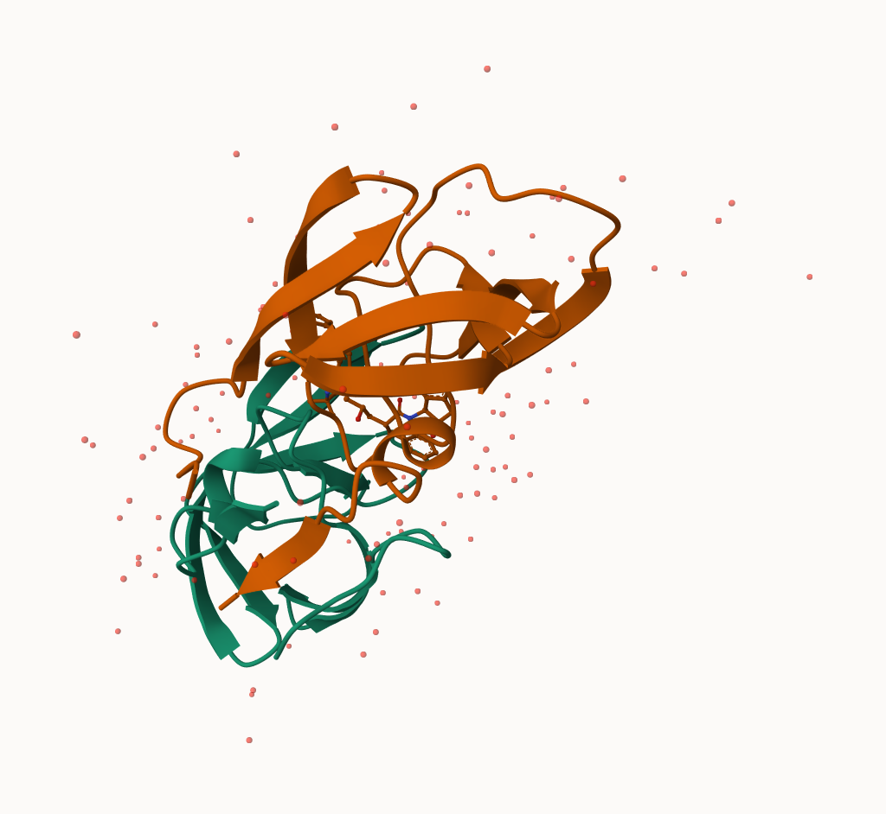
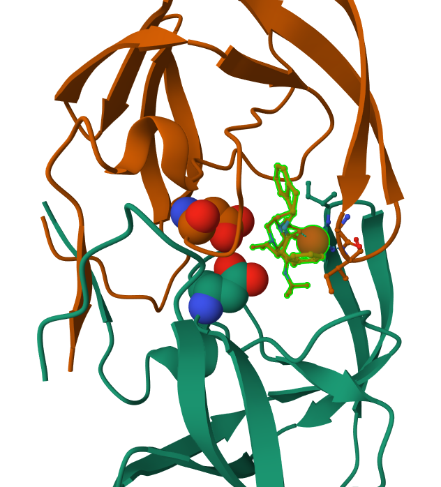
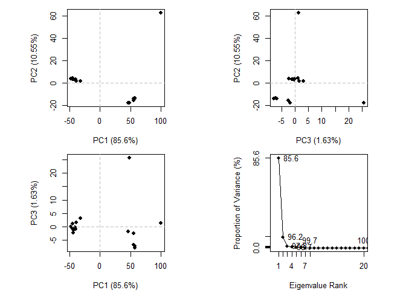

# class10_structural bioinformatics
Angie Zhou (PID:A69028746)
2024-02-09

## 1. Introduction to the RCSB Protein Data Bank (PDB)

``` r
Data_file <- "Data Export Summary.csv"
pdbstats= read.csv(Data_file, row.names=1)
summary(pdbstats)
```

        X.ray                EM                NMR            Multiple.methods
     Length:6           Length:6           Length:6           Min.   :  0.00  
     Class :character   Class :character   Class :character   1st Qu.:  2.50  
     Mode  :character   Mode  :character   Mode  :character   Median :  7.50  
                                                              Mean   : 38.33  
                                                              3rd Qu.: 12.50  
                                                              Max.   :200.00  
        Neutron          Other           Total          
     Min.   : 0.00   Min.   : 0.000   Length:6          
     1st Qu.: 0.00   1st Qu.: 0.000   Class :character  
     Median : 1.00   Median : 0.500   Mode  :character  
     Mean   :13.17   Mean   : 6.167                     
     3rd Qu.: 2.75   3rd Qu.: 3.250                     
     Max.   :74.00   Max.   :32.000                     

``` r
head(pdbstats)
```

                              X.ray     EM    NMR Multiple.methods Neutron Other
    Protein (only)          161,663 12,592 12,337              200      74    32
    Protein/Oligosaccharide   9,348  2,167     34                8       2     0
    Protein/NA                8,404  3,924    286                7       0     0
    Nucleic acid (only)       2,758    125  1,477               14       3     1
    Other                       164      9     33                0       0     0
    Oligosaccharide (only)       11      0      6                1       0     4
                              Total
    Protein (only)          186,898
    Protein/Oligosaccharide  11,559
    Protein/NA               12,621
    Nucleic acid (only)       4,378
    Other                       206
    Oligosaccharide (only)       22

``` r
# code extract function
  commasum <- function(x) {
    # Remomve comma, convert to numeric and sum
    sum(as.numeric(gsub(",", "", x)))
  }
```

``` r
commasum((pdbstats$X.ray))
```

    [1] 182348

> **Q1:** What percentage of structures in the PDB are solved by X-Ray
> and Electron Microscopy. **A1:** X.ray: 84.54 % and EM: 8.72%

``` r
round(apply(pdbstats, 2, commasum)/commasum(pdbstats$Total)*100, 2)
```

               X.ray               EM              NMR Multiple.methods 
               84.54             8.72             6.57             0.11 
             Neutron            Other            Total 
                0.04             0.02           100.00 

> **Q2:** What proportion of structures in the PDB are protein?

> **A2:** 97.86%

``` r
protein_structures_total <- pdbstats[1:3,7]
protein_structures_total
```

    [1] "186,898" "11,559"  "12,621" 

``` r
round(commasum(protein_structures_total)/commasum(pdbstats$Total)*100, 2)
```

    [1] 97.86

> Q. How does the total number of protein structures iN the PDB relate
> to the total number of protein sequences in Uniport?

``` r
186898/250322721*100
```

    [1] 0.07466282



> **Q3:** Type HIV in the PDB website search box on the home page and
> determine how many HIV-1 protease structures are in the current PDB?

> **A3:** There are 486 HIV-1 protease structures

## 2. Visualizing the HIV-1 protease structure

> **Q4:** Water molecules normally have 3 atoms. Why do we see just one
> atom per water molecule in this structure? **A4:** The resolution is
> not high enough to see H.

> **Q5:** There is a critical “conserved” water molecule in the binding
> site. Can you identify this water molecule? What residue number does
> this water molecule have **A5:**Yes, HOH308

> **Q6:** Generate and save a figure clearly showing the two distinct
> chains of HIV-protease along with the ligand. You might also consider
> showing the catalytic residues ASP 25 in each chain and the critical
> water (we recommend “Ball & Stick” for these side-chains). Add this
> figure to your Quarto document.



## 3. Introduction to Bio3D in R

``` r
library(bio3d)
```

    Warning: package 'bio3d' was built under R version 4.3.3

``` r
hiv <- read.pdb("1hsg")
```

      Note: Accessing on-line PDB file

``` r
hiv
```


     Call:  read.pdb(file = "1hsg")

       Total Models#: 1
         Total Atoms#: 1686,  XYZs#: 5058  Chains#: 2  (values: A B)

         Protein Atoms#: 1514  (residues/Calpha atoms#: 198)
         Nucleic acid Atoms#: 0  (residues/phosphate atoms#: 0)

         Non-protein/nucleic Atoms#: 172  (residues: 128)
         Non-protein/nucleic resid values: [ HOH (127), MK1 (1) ]

       Protein sequence:
          PQITLWQRPLVTIKIGGQLKEALLDTGADDTVLEEMSLPGRWKPKMIGGIGGFIKVRQYD
          QILIEICGHKAIGTVLVGPTPVNIIGRNLLTQIGCTLNFPQITLWQRPLVTIKIGGQLKE
          ALLDTGADDTVLEEMSLPGRWKPKMIGGIGGFIKVRQYDQILIEICGHKAIGTVLVGPTP
          VNIIGRNLLTQIGCTLNF

    + attr: atom, xyz, seqres, helix, sheet,
            calpha, remark, call

``` r
attributes(hiv)
```

    $names
    [1] "atom"   "xyz"    "seqres" "helix"  "sheet"  "calpha" "remark" "call"  

    $class
    [1] "pdb" "sse"

``` r
aa123(pdbseq(hiv)[25])
```

    [1] "ASP"

``` r
head(hiv$atom)
```

      type eleno elety  alt resid chain resno insert      x      y     z o     b
    1 ATOM     1     N <NA>   PRO     A     1   <NA> 29.361 39.686 5.862 1 38.10
    2 ATOM     2    CA <NA>   PRO     A     1   <NA> 30.307 38.663 5.319 1 40.62
    3 ATOM     3     C <NA>   PRO     A     1   <NA> 29.760 38.071 4.022 1 42.64
    4 ATOM     4     O <NA>   PRO     A     1   <NA> 28.600 38.302 3.676 1 43.40
    5 ATOM     5    CB <NA>   PRO     A     1   <NA> 30.508 37.541 6.342 1 37.87
    6 ATOM     6    CG <NA>   PRO     A     1   <NA> 29.296 37.591 7.162 1 38.40
      segid elesy charge
    1  <NA>     N   <NA>
    2  <NA>     C   <NA>
    3  <NA>     C   <NA>
    4  <NA>     O   <NA>
    5  <NA>     C   <NA>
    6  <NA>     C   <NA>

## 4. Reading PDB file data into R

> **Q7:** How many amino acid residues are there in this pdb object?

> **A7:** There are 198 amino acid

> **Q8:** Name one of the two non-protein residues?

> **A8:** HOH/MK1

> **Q9:** How many protein chains are in this structure?

> **A9:** There are 2 protein chains

``` r
adk <- read.pdb("6s36")
```

      Note: Accessing on-line PDB file
       PDB has ALT records, taking A only, rm.alt=TRUE

``` r
adk
```


     Call:  read.pdb(file = "6s36")

       Total Models#: 1
         Total Atoms#: 1898,  XYZs#: 5694  Chains#: 1  (values: A)

         Protein Atoms#: 1654  (residues/Calpha atoms#: 214)
         Nucleic acid Atoms#: 0  (residues/phosphate atoms#: 0)

         Non-protein/nucleic Atoms#: 244  (residues: 244)
         Non-protein/nucleic resid values: [ CL (3), HOH (238), MG (2), NA (1) ]

       Protein sequence:
          MRIILLGAPGAGKGTQAQFIMEKYGIPQISTGDMLRAAVKSGSELGKQAKDIMDAGKLVT
          DELVIALVKERIAQEDCRNGFLLDGFPRTIPQADAMKEAGINVDYVLEFDVPDELIVDKI
          VGRRVHAPSGRVYHVKFNPPKVEGKDDVTGEELTTRKDDQEETVRKRLVEYHQMTAPLIG
          YYSKEAEAGNTKYAKVDGTKPVAEVRADLEKILG

    + attr: atom, xyz, seqres, helix, sheet,
            calpha, remark, call

normal mode analysis(nma) a bioinformatic method to predict functional
motions and large-scale structure changes

``` r
m <- nma(adk)
```

     Building Hessian...        Done in 0.06 seconds.
     Diagonalizing Hessian...   Done in 0.5 seconds.

``` r
plot(m)
```


make a wee movie

``` r
mktrj(m, file="adk_m7.pdb")
```

Extract a sequence and run a blast

``` r
s <- pdbseq(adk)
blast <- blast.pdb(s)
```

     Searching ... please wait (updates every 5 seconds) RID = ZC8ECYW201R 
     .
     Reporting 83 hits

``` r
plot(blast)
```

      * Possible cutoff values:    196 9 
                Yielding Nhits:    17 83 

      * Chosen cutoff value of:    196 
                Yielding Nhits:    17 


get the results from BLAST and download all the top hits.

``` r
hits <- plot(blast)
```

      * Possible cutoff values:    196 9 
                Yielding Nhits:    17 83 

      * Chosen cutoff value of:    196 
                Yielding Nhits:    17 


``` r
hits
```

    $hits
       pdb.id   acc      group
    1  "6S36_A" "6S36_A" "1"  
    2  "1AKE_A" "1AKE_A" "1"  
    3  "8BQF_A" "8BQF_A" "1"  
    4  "6RZE_A" "6RZE_A" "1"  
    5  "4X8M_A" "4X8M_A" "1"  
    6  "4X8H_A" "4X8H_A" "1"  
    7  "1E4V_A" "1E4V_A" "1"  
    8  "3HPR_A" "3HPR_A" "1"  
    9  "5EJE_A" "5EJE_A" "1"  
    10 "1E4Y_A" "1E4Y_A" "1"  
    11 "3X2S_A" "3X2S_A" "1"  
    12 "6HAP_A" "6HAP_A" "1"  
    13 "6HAM_A" "6HAM_A" "1"  
    14 "4K46_A" "4K46_A" "1"  
    15 "4NP6_A" "4NP6_A" "1"  
    16 "3GMT_A" "3GMT_A" "1"  
    17 "4PZL_A" "4PZL_A" "1"  

    $pdb.id
     [1] "6S36_A" "1AKE_A" "8BQF_A" "6RZE_A" "4X8M_A" "4X8H_A" "1E4V_A" "3HPR_A"
     [9] "5EJE_A" "1E4Y_A" "3X2S_A" "6HAP_A" "6HAM_A" "4K46_A" "4NP6_A" "3GMT_A"
    [17] "4PZL_A"

    $acc
     [1] "6S36_A" "1AKE_A" "8BQF_A" "6RZE_A" "4X8M_A" "4X8H_A" "1E4V_A" "3HPR_A"
     [9] "5EJE_A" "1E4Y_A" "3X2S_A" "6HAP_A" "6HAM_A" "4K46_A" "4NP6_A" "3GMT_A"
    [17] "4PZL_A"

    $inds
     [1]  TRUE  TRUE  TRUE  TRUE  TRUE  TRUE  TRUE  TRUE  TRUE  TRUE  TRUE  TRUE
    [13]  TRUE  TRUE  TRUE  TRUE  TRUE FALSE FALSE FALSE FALSE FALSE FALSE FALSE
    [25] FALSE FALSE FALSE FALSE FALSE FALSE FALSE FALSE FALSE FALSE FALSE FALSE
    [37] FALSE FALSE FALSE FALSE FALSE FALSE FALSE FALSE FALSE FALSE FALSE FALSE
    [49] FALSE FALSE FALSE FALSE FALSE FALSE FALSE FALSE FALSE FALSE FALSE FALSE
    [61] FALSE FALSE FALSE FALSE FALSE FALSE FALSE FALSE FALSE FALSE FALSE FALSE
    [73] FALSE FALSE FALSE FALSE FALSE FALSE FALSE FALSE FALSE FALSE FALSE

    attr(,"class")
    [1] "blast"

``` r
hits$pdb.id
```

     [1] "6S36_A" "1AKE_A" "8BQF_A" "6RZE_A" "4X8M_A" "4X8H_A" "1E4V_A" "3HPR_A"
     [9] "5EJE_A" "1E4Y_A" "3X2S_A" "6HAP_A" "6HAM_A" "4K46_A" "4NP6_A" "3GMT_A"
    [17] "4PZL_A"

``` r
# Download related PDB files
# files <- get.pdb(hits$pdb.id, path="pdbs", split=TRUE, gzip=TRUE)
```

``` r
BiocManager::install("msa")
```

    Bioconductor version 3.18 (BiocManager 1.30.22), R 4.3.2 (2023-10-31 ucrt)

    Warning: package(s) not installed when version(s) same as or greater than current; use
      `force = TRUE` to re-install: 'msa'

    Installation paths not writeable, unable to update packages
      path: C:/Program Files/R/R-4.3.2/library
      packages:
        boot, cluster, foreign, lattice, MASS, Matrix, mgcv, nlme, rpart, survival

    Old packages: 'Biostrings', 'DESeq2', 'digest', 'multcompView', 'processx',
      'ragg', 'sass', 'systemfonts', 'tidyselect', 'tinytex', 'xfun', 'zlibbioc'

``` r
devtools::install_bitbucket("Grantlab/bio3d-view")
```

    Downloading bitbucket repo Grantlab/bio3d-view@HEAD


    ── R CMD build ─────────────────────────────────────────────────────────────────
    * checking for file 'C:\Users\Askying\AppData\Local\Temp\RtmpSIOswz\remotes3e383a6131b4\Grantlab-bio3d-view-dd1539876fa8/DESCRIPTION' ... OK
    * preparing 'bio3d.view':
    * checking DESCRIPTION meta-information ... OK
    * checking for LF line-endings in source and make files and shell scripts
    * checking for empty or unneeded directories
    Omitted 'LazyData' from DESCRIPTION
    * building 'bio3d.view_0.1.0.9000.tar.gz'

    Installing package into 'C:/Users/Askying/AppData/Local/R/win-library/4.3'
    (as 'lib' is unspecified)

## 4. Comparative structure analysis of Adenylate Kinase

> **Q10.** Which of the packages above is found only on BioConductor and
> not CRAN?

> **A10.** The package “msa” is found only on Bioconductor and not on
> CRAN

> **Q11.** Which of the above packages is not found on BioConductor or
> CRAN?:

> **A11.** The package “bio3d-view” installed using
> devtools::install_bitbucket(“Grantlab/bio3d-view”) is not from
> Bioconductor or CRAN.

> **Q12.** True or False? Functions from the devtools package can be
> used to install packages from GitHub and BitBucket?

> **A12.** True

## PCA of all these

``` r
# Perform PCA
library(bio3d)
aa <- get.seq("1ake_A")
```

    Warning in get.seq("1ake_A"): Removing existing file: seqs.fasta

    Fetching... Please wait. Done.

``` r
files <- get.pdb(hits$pdb.id, path="pdbs", split=TRUE, gzip=TRUE)
```

    Warning in get.pdb(hits$pdb.id, path = "pdbs", split = TRUE, gzip = TRUE):
    pdbs/6S36.pdb exists. Skipping download

    Warning in get.pdb(hits$pdb.id, path = "pdbs", split = TRUE, gzip = TRUE):
    pdbs/1AKE.pdb exists. Skipping download

    Warning in get.pdb(hits$pdb.id, path = "pdbs", split = TRUE, gzip = TRUE):
    pdbs/8BQF.pdb exists. Skipping download

    Warning in get.pdb(hits$pdb.id, path = "pdbs", split = TRUE, gzip = TRUE):
    pdbs/6RZE.pdb exists. Skipping download

    Warning in get.pdb(hits$pdb.id, path = "pdbs", split = TRUE, gzip = TRUE):
    pdbs/4X8M.pdb exists. Skipping download

    Warning in get.pdb(hits$pdb.id, path = "pdbs", split = TRUE, gzip = TRUE):
    pdbs/4X8H.pdb exists. Skipping download

    Warning in get.pdb(hits$pdb.id, path = "pdbs", split = TRUE, gzip = TRUE):
    pdbs/1E4V.pdb exists. Skipping download

    Warning in get.pdb(hits$pdb.id, path = "pdbs", split = TRUE, gzip = TRUE):
    pdbs/3HPR.pdb exists. Skipping download

    Warning in get.pdb(hits$pdb.id, path = "pdbs", split = TRUE, gzip = TRUE):
    pdbs/5EJE.pdb exists. Skipping download

    Warning in get.pdb(hits$pdb.id, path = "pdbs", split = TRUE, gzip = TRUE):
    pdbs/1E4Y.pdb exists. Skipping download

    Warning in get.pdb(hits$pdb.id, path = "pdbs", split = TRUE, gzip = TRUE):
    pdbs/3X2S.pdb exists. Skipping download

    Warning in get.pdb(hits$pdb.id, path = "pdbs", split = TRUE, gzip = TRUE):
    pdbs/6HAP.pdb exists. Skipping download

    Warning in get.pdb(hits$pdb.id, path = "pdbs", split = TRUE, gzip = TRUE):
    pdbs/6HAM.pdb exists. Skipping download

    Warning in get.pdb(hits$pdb.id, path = "pdbs", split = TRUE, gzip = TRUE):
    pdbs/4K46.pdb exists. Skipping download

    Warning in get.pdb(hits$pdb.id, path = "pdbs", split = TRUE, gzip = TRUE):
    pdbs/4NP6.pdb exists. Skipping download

    Warning in get.pdb(hits$pdb.id, path = "pdbs", split = TRUE, gzip = TRUE):
    pdbs/3GMT.pdb exists. Skipping download

    Warning in get.pdb(hits$pdb.id, path = "pdbs", split = TRUE, gzip = TRUE):
    pdbs/4PZL.pdb exists. Skipping download


      |                                                                            
      |                                                                      |   0%
      |                                                                            
      |====                                                                  |   6%
      |                                                                            
      |========                                                              |  12%
      |                                                                            
      |============                                                          |  18%
      |                                                                            
      |================                                                      |  24%
      |                                                                            
      |=====================                                                 |  29%
      |                                                                            
      |=========================                                             |  35%
      |                                                                            
      |=============================                                         |  41%
      |                                                                            
      |=================================                                     |  47%
      |                                                                            
      |=====================================                                 |  53%
      |                                                                            
      |=========================================                             |  59%
      |                                                                            
      |=============================================                         |  65%
      |                                                                            
      |=================================================                     |  71%
      |                                                                            
      |======================================================                |  76%
      |                                                                            
      |==========================================================            |  82%
      |                                                                            
      |==============================================================        |  88%
      |                                                                            
      |==================================================================    |  94%
      |                                                                            
      |======================================================================| 100%

``` r
pdbs <- pdbaln(files, fit = TRUE, exefile="msa")
```

    Reading PDB files:
    pdbs/split_chain/6S36_A.pdb
    pdbs/split_chain/1AKE_A.pdb
    pdbs/split_chain/8BQF_A.pdb
    pdbs/split_chain/6RZE_A.pdb
    pdbs/split_chain/4X8M_A.pdb
    pdbs/split_chain/4X8H_A.pdb
    pdbs/split_chain/1E4V_A.pdb
    pdbs/split_chain/3HPR_A.pdb
    pdbs/split_chain/5EJE_A.pdb
    pdbs/split_chain/1E4Y_A.pdb
    pdbs/split_chain/3X2S_A.pdb
    pdbs/split_chain/6HAP_A.pdb
    pdbs/split_chain/6HAM_A.pdb
    pdbs/split_chain/4K46_A.pdb
    pdbs/split_chain/4NP6_A.pdb
    pdbs/split_chain/3GMT_A.pdb
    pdbs/split_chain/4PZL_A.pdb
       PDB has ALT records, taking A only, rm.alt=TRUE
    .   PDB has ALT records, taking A only, rm.alt=TRUE
    .   PDB has ALT records, taking A only, rm.alt=TRUE
    .   PDB has ALT records, taking A only, rm.alt=TRUE
    ....   PDB has ALT records, taking A only, rm.alt=TRUE
    .   PDB has ALT records, taking A only, rm.alt=TRUE
    ....   PDB has ALT records, taking A only, rm.alt=TRUE
    .   PDB has ALT records, taking A only, rm.alt=TRUE
    ....

    Extracting sequences

    pdb/seq: 1   name: pdbs/split_chain/6S36_A.pdb 
       PDB has ALT records, taking A only, rm.alt=TRUE
    pdb/seq: 2   name: pdbs/split_chain/1AKE_A.pdb 
       PDB has ALT records, taking A only, rm.alt=TRUE
    pdb/seq: 3   name: pdbs/split_chain/8BQF_A.pdb 
       PDB has ALT records, taking A only, rm.alt=TRUE
    pdb/seq: 4   name: pdbs/split_chain/6RZE_A.pdb 
       PDB has ALT records, taking A only, rm.alt=TRUE
    pdb/seq: 5   name: pdbs/split_chain/4X8M_A.pdb 
    pdb/seq: 6   name: pdbs/split_chain/4X8H_A.pdb 
    pdb/seq: 7   name: pdbs/split_chain/1E4V_A.pdb 
    pdb/seq: 8   name: pdbs/split_chain/3HPR_A.pdb 
       PDB has ALT records, taking A only, rm.alt=TRUE
    pdb/seq: 9   name: pdbs/split_chain/5EJE_A.pdb 
       PDB has ALT records, taking A only, rm.alt=TRUE
    pdb/seq: 10   name: pdbs/split_chain/1E4Y_A.pdb 
    pdb/seq: 11   name: pdbs/split_chain/3X2S_A.pdb 
    pdb/seq: 12   name: pdbs/split_chain/6HAP_A.pdb 
    pdb/seq: 13   name: pdbs/split_chain/6HAM_A.pdb 
       PDB has ALT records, taking A only, rm.alt=TRUE
    pdb/seq: 14   name: pdbs/split_chain/4K46_A.pdb 
       PDB has ALT records, taking A only, rm.alt=TRUE
    pdb/seq: 15   name: pdbs/split_chain/4NP6_A.pdb 
    pdb/seq: 16   name: pdbs/split_chain/3GMT_A.pdb 
    pdb/seq: 17   name: pdbs/split_chain/4PZL_A.pdb 

``` r
pc.xray <- pca(pdbs)
plot(pc.xray)
```



``` r
mktrj(pc.xray, file = "pca_movie.pdb")
```

> **Q13.** How many amino acids are in this sequence, i.e. how long is
> this sequence?

> **A13.** 214 aa
